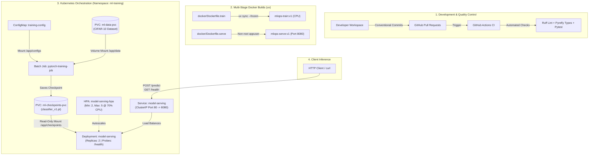

# MLOps Pipeline with Docker and Kubernetes for Deploying PyTorch Image Classification Model

End-to-end Production-ready ML Pipeline illustrating an entire deployment life cycle of a PyTorch image classification model (CIFAR-10): from local dev using Git Workflows and uv Package Manager to multi-stage containerized docker builds and then automated job scheduling for training followed by autoscaling of inference service in Kubernetes.

---

## System Architecture



---

## Repository Structure

```
mlops-pytorch-pipeline/
├── .github/
│   └── workflows/
│       └── ci.yml                # CI pipeline (Ruff, Pyrefly, Pytest, Docker build tests)
├── .pre-commit-config.yaml       # Pre-commit hooks configuration (Ruff, Pyrefly, file hygiene)
├── pyproject.toml                # Centralized project dependencies & uv tool configuration
├── pyrefly.toml                  # Fast Python type checker configuration
├── configs/
│   └── training_config.yaml      # Model hyperparameters, dataset paths, & step logging config
├── docker/
│   ├── Dockerfile.train          # Multi-stage optimized PyTorch training image (uv builder)
│   └── Dockerfile.serve          # Slim non-root FastAPI serving image with container HEALTHCHECK
├── k8s/
│   ├── namespace.yaml            # Isolated `ml-training` namespace definition
│   ├── configmap.yaml            # Kubernetes ConfigMap injecting training hyperparameters
│   ├── training-job.yaml         # PersistentVolumeClaims (RWO) and PyTorch batch Job
│   ├── serving-deployment.yaml   # Serving Deployment (2 replicas, rolling updates, health probes)
│   ├── serving-service.yaml      # ClusterIP Service exposing port 80 -> 8080
│   └── hpa.yaml                  # HorizontalPodAutoscaler (2-5 replicas @ 70% CPU)
├── requirements/
│   ├── train.txt                 # Training dependencies (provided for assignment conformity)
│   └── serve.txt                 # Serving inference dependencies
├── samples/                      # Extracted sample PNG images (all 10 CIFAR-10 classes)
├── scripts/
│   └── verify_local.sh           # End-to-end local Docker build, run, and inference verification
├── src/
│   ├── dataset.py                # Torchvision CIFAR-10 data loaders, augmentations, and SSL setup
│   ├── model.py                  # PyTorch model definitions (ResNet-18 & SimpleCNN)
│   ├── train.py                  # Training loop with JSON lines logs, step metrics & early stopping
│   └── serve.py                  # FastAPI inference API (/health and /predict endpoints with lifespan)
└── tests/
    └── test_model.py             # Pytest unit tests for model forward pass & output shapes
```

---

## Prerequisites

- **Python**: `3.13+`
- **Package Manager**: [`uv`](https://docs.astral.sh/uv/)
- **Docker**: Docker Desktop (or Linux Docker daemon)
- **Kubernetes**: `kubectl` CLI with local cluster enabled (Docker Desktop K8s, Minikube, or `kind`)

---

## Local Development Quickstart

### 1. Setup Virtual Environment with `uv`
```bash
# Sync all dependency groups into an isolated virtual environment
uv sync --all-groups

# (Optional) Install git pre-commit hooks for automated code quality checks
uv run pre-commit install
```

### 2. Run Code Quality Checks & Unit Tests
```bash
# Linting & code formatting
uv run ruff check .
uv run ruff format --check .

# Type checking
uv run pyrefly check

# Execute pytest suite
uv run pytest tests/ -v
```

### 3. Local Training & Inference API
```bash
# Run local PyTorch training
uv run python src/train.py

# Start local FastAPI model serving API
uv run uvicorn serve:app --host 0.0.0.0 --port 8080 --app-dir src

# Test health check endpoint
curl http://localhost:8080/health

# Test prediction endpoint with a sample image
curl -X POST http://localhost:8080/predict -F "image=@samples/airplane.png"
```

---

## Docker Containerization (Part C)

Both images follow best-practice multi-stage builds using `ghcr.io/astral-sh/uv:python3.13-bookworm-slim` for fast dependency resolution and `python:3.13-slim` for minimal runtime image footprints.

### 1. Build Docker Images
```bash
# Build training image
docker build -f docker/Dockerfile.train -t mlops-train:v1 .

# Build serving image (non-root user with container HEALTHCHECK)
docker build -f docker/Dockerfile.serve -t mlops-serve:v1 .
```

### 2. Run Containerized Workloads Locally
```bash
# Run containerized training with volume mounts
docker run --rm \
  -v $(pwd)/data:/app/data \
  -v $(pwd)/checkpoints:/app/checkpoints \
  mlops-train:v1

# Run serving container
docker run --rm -p 8080:8080 \
  -v $(pwd)/checkpoints:/app/checkpoints \
  mlops-serve:v1
```

### 3. Automated Local Verification Script
To execute all local build, training, serving, and inference tests in one automated command:
```bash
./scripts/verify_local.sh
```

---

## Kubernetes Deployment (Parts D, E & F)

### Step 1: Initialize Namespace & ConfigMap
```bash
kubectl apply -f k8s/namespace.yaml
kubectl apply -f k8s/configmap.yaml
```

### Step 2: Launch Training Job
```bash
kubectl apply -f k8s/training-job.yaml

# Stream live training metrics and JSON logs
kubectl logs -l app=pytorch-training -n ml-training -f
```

### Step 3: Deploy Autoscaled Serving Layer
Once the training Job completes and writes `classifier_v1.pt` to the PersistentVolumeClaim:
```bash
kubectl apply -f k8s/serving-deployment.yaml
kubectl apply -f k8s/serving-service.yaml
kubectl apply -f k8s/hpa.yaml
```

### Step 4: Verify Pods, Service & Health Probes
```bash
# Check pod and deployment status
kubectl get pods,svc,hpa -n ml-training
kubectl describe deployment model-serving -n ml-training
```

### Step 5: Test End-to-End Prediction via Port-Forwarding
```bash
# Forward traffic from localhost:8080 to Service port 80
kubectl port-forward svc/model-serving 8080:80 -n ml-training

# In another terminal:
# 1. Health check (should return 200 OK)
curl http://localhost:8080/health

# 2. Model prediction
curl -X POST http://localhost:8080/predict -F "image=@samples/frog.png"
```

**Sample Prediction Response:**
```json
{
  "prediction": "frog",
  "class_id": 6,
  "probabilities": {
    "airplane": 0.0125,
    "automobile": 0.0041,
    "bird": 0.0312,
    "cat": 0.0521,
    "deer": 0.0218,
    "dog": 0.0439,
    "frog": 0.7812,
    "horse": 0.0154,
    "ship": 0.0089,
    "truck": 0.0289
  }
}
```

---

## Git Workflow & Pull Requests

This repository strictly adheres to Git flow and [Conventional Commits](https://www.conventionalcommits.org/):

- **`main`**: Production release branch.
- **`develop`**: Primary integration branch.
- **`feature/*`**: Isolated feature branches merged via reviewed Pull Requests with structured changelogs.

### Pull Requests Summary:
1. **PR #1 (`feature/requirements` ➔ `develop`)**: Setup `uv` package management, `pyproject.toml`, lockfiles, and CPU-only PyTorch indexes.
2. **PR #2 (`feature/ci` ➔ `develop`)**: Added GitHub Actions CI pipeline with Ruff linting, Pyrefly type checking, pytest, and Docker build validation.
3. **PR #3 (`feature/modelling` ➔ `develop`)**: Implemented PyTorch model architecture, CIFAR-10 data loaders, training loop with JSON metrics, and FastAPI inference serving.
4. **PR #4 (`feat/kubernetes` ➔ `develop` / `main`)**: Implemented multi-stage Dockerfiles, Kubernetes Job, persistent storage claims, autoscaled Deployments with health probes, and verification scripts.

---

## Reflection & technical analysis

### 1. What was the most difficult part of this project?
The most difficult portion of developing this pipeline was managing **persistence of data in Kubernetes asynchronous Job streams**, as well as **containerized storage provisioning:**
- **compatibility between storage class access modes and provisioning for local containers**: the local provisioners for Kubernetes (for example docker desktop/rancher `local-path`) can only provide a `ReadWriteOnce` access mode. Distributed clusters utilize cloud-based or NFS file systems that provide a `ReadWriteMany` access mode. Creating a checkpoint persistent volume claim that was writable by the batch Job and subsequently read-only mounted by the serving deployment required managing both the storage life cycle and isolation.
- **probing timings & cold starts**: during initialization, the container loads the PyTorch model weights from disk into memory. By tuning `initialdelayseconds` (15 seconds) and `periodseconds` on the Readiness Probe, we could prevent Kubernetes from routing user-inference requests to uninitialized containers during the initial cold-start process.

### 2. Using astral’s uv in a multi-stage build to improve dependencies
Utilizing astral’s uv within our docker multi-stage builds (`ghcr.io/astral-sh/uv` builder + `python:3.13-slim` runtime) greatly improved our build speeds and allowed us to take advantage of docker’s layer caching. We configured an explicit PyTorch-cpu wheel index to preclude the need for multi-gigabyte CUDA binaries to bloat our image size and keep the final serving container lightweight and fast to start.
